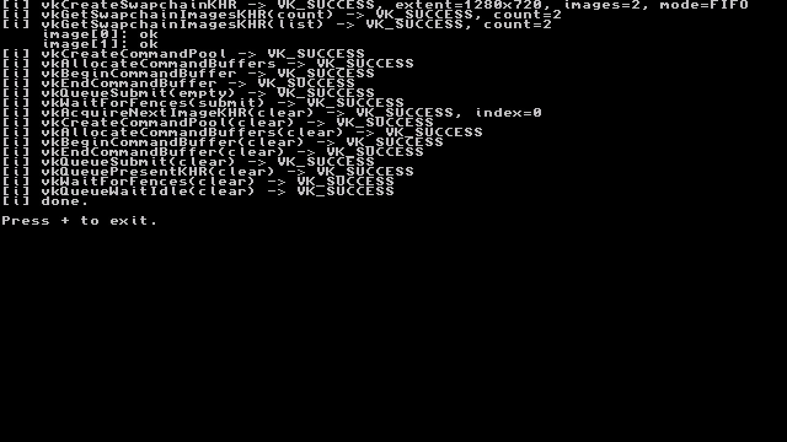

# NVK Smoke Test

Minimal Vulkan bring-up probe for Nintendo Switch homebrew.

This example checks that the NVK build can create a Vulkan instance, find a
physical device, create a VI surface, and exercise the swapchain/acquire/present
path far enough to expose driver bring-up failures.



## Files

- `SmokeTest.cpp` - the example source.
- `build.sh` - builds `build/SmokeTest.nro`.

## Flow

1. Start the libnx console.
2. Enumerate instance extensions.
3. Create a `VkInstance` with `VK_KHR_surface` and `VK_NN_vi_surface`.
4. Select the first physical device and inspect present support.
5. Probe device creation, command submission, swapchain creation, acquire,
   clear, and present.
6. Destroy Vulkan objects and wait for + before exit.

## Build

Build or pull Docker image first. In this workspace, build it
from the Mesa tree with:

```sh
../nvk-image/create-nvk-image.sh /path/to/mesa
```

Then build the example:

```sh
./build.sh
```

The script runs the build inside the Docker image and mounts this project
automatically.
